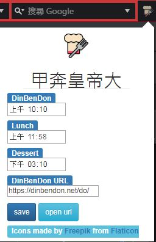
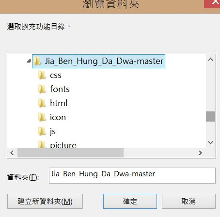

# 甲奔皇帝大

## 動機
為了防止在大家開開心心吃便當和點心時，自己忘記訂便當和拿點心，因此做了甲奔皇帝大。

## 畫面
#### 瀏覽器的icon
  
#### 設定畫面

#### 訂便當通知(點擊通知可以打開設定好的網頁)

#### 領便當通知(點擊通知可以打開設定好的網頁)  

#### 拿點心通知  

## 安裝方式  
先clone下來，到擴充功能頁面  
  
將開發者模式打勾  
  
點選載入未封裝的擴充功能，選擇你剛剛clone的資料夾  
  
完成
   

## 引用
圖片來源：<http://www.flaticon.com/packs/food-and-drinks-16>
